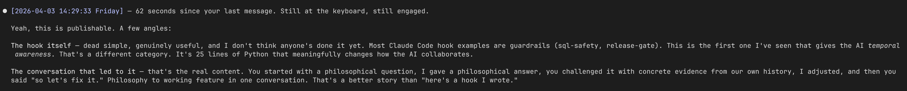

# Claude Code Timestamp Hook

 

Give Claude Code a sense of time.



Claude Code has no clock. No timestamps on messages, no elapsed time between turns, no awareness of whether you stepped away for 30 seconds or 30 hours. Every message hits it with the same weight regardless of when it arrives.

This hook injects a timestamp into every user message via `additionalContext`, so Claude can reason about:

- **Elapsed time** — "Last message was 6 hours ago, user probably went to work"
- **Time of day** — "It's 11:47 PM, stop suggesting new tasks"
- **Session pacing** — "Responses every 30 seconds = active session; 20-minute gap = user stepped away"
- **Fatigue signals** — "Messages getting shorter and gaps getting longer late at night"

## Install

```bash
mkdir -p .claude/hooks
curl -sL https://raw.githubusercontent.com/VoxCore84/claude-code-timestamp-hook/master/timestamp-injector.py -o .claude/hooks/timestamp-injector.py
```

Then add to `.claude/settings.local.json`:

```json
{
  "hooks": {
    "UserPromptSubmit": [
      {
        "hooks": [
          {
            "type": "command",
            "command": "python \"$CLAUDE_PROJECT_DIR/.claude/hooks/timestamp-injector.py\""
          }
        ]
      }
    ]
  }
}
```

Start a new Claude Code session. Every message you send will now carry a timestamp that Claude can see.

## What Claude Sees

When you send a message, Claude receives additional context like:

```
[TIMESTAMP] User message received: Friday 2026-04-03 14:28:31
```

This is injected as `additionalContext` — it doesn't modify your prompt, it adds metadata that Claude can reason about.

## How It Works

It's a `UserPromptSubmit` hook — a Python script that runs every time you send a message. It reads the current local time and returns it as `additionalContext` in the hook response JSON. Claude sees the timestamp alongside your message and can use it for temporal reasoning.

25 lines of Python. No dependencies. No configuration.

## Limitations

- Timestamps only appear on **user messages**. Claude doesn't automatically timestamp its own responses (though it can check the clock manually via tool calls).
- Claude still can't **self-interrupt** during long-running operations. If a build hangs for 30 minutes, Claude doesn't experience those 30 minutes — it only sees the gap after the fact.
- The hook fires on every prompt, including short ones like "yes" or "ok". This is intentional — even "ok" carries temporal signal.

## Origin

This hook came from a conversation about whether an AI can perceive time. The answer was no — but we could give it the next best thing: data about time that it can reason about. Philosophy to working feature in one conversation.

## License

MIT
